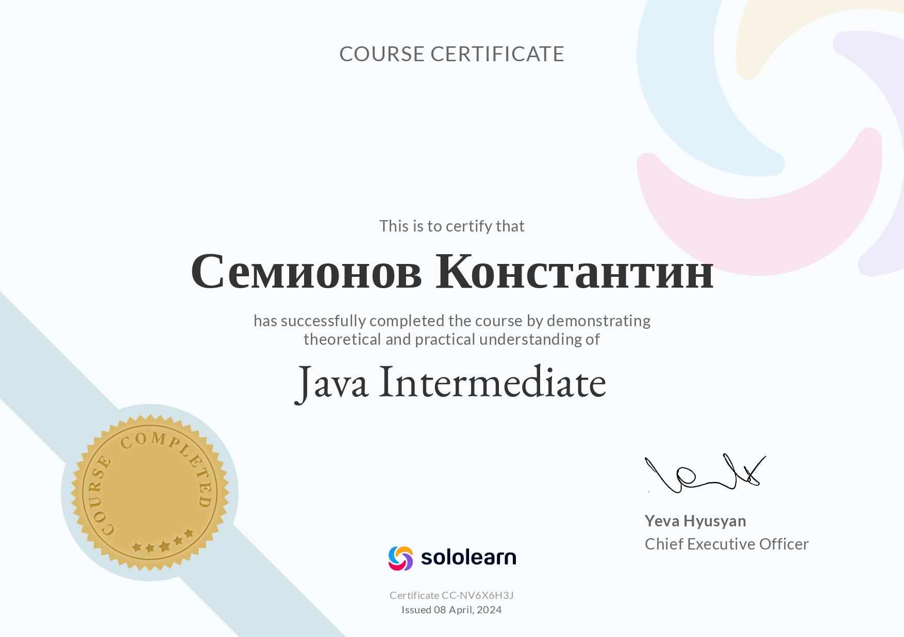
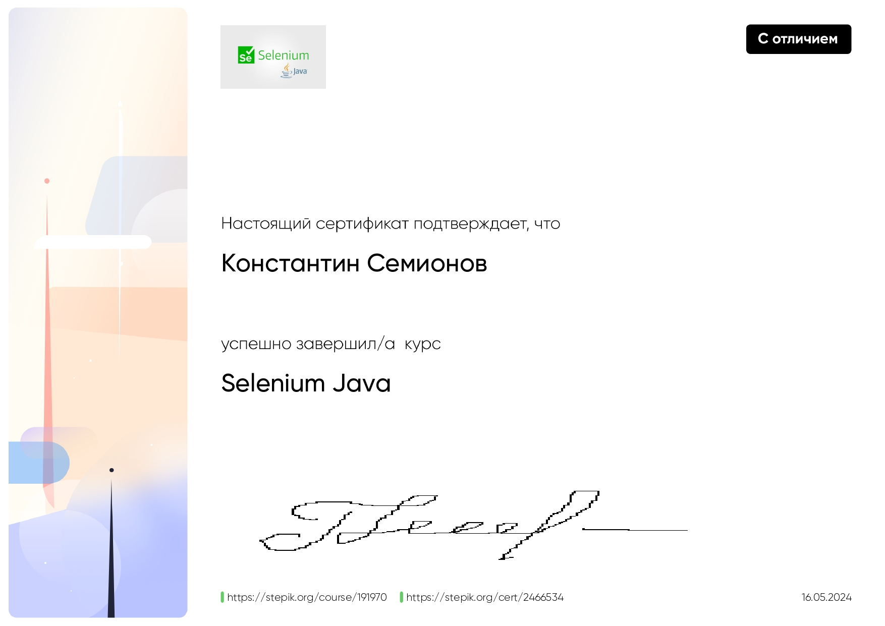
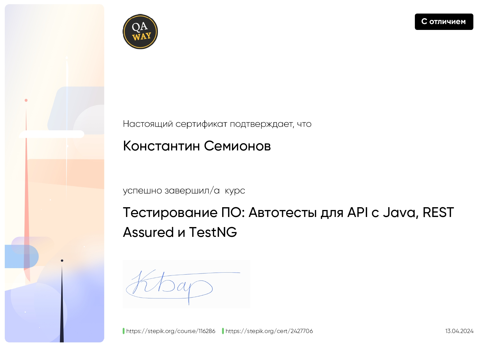
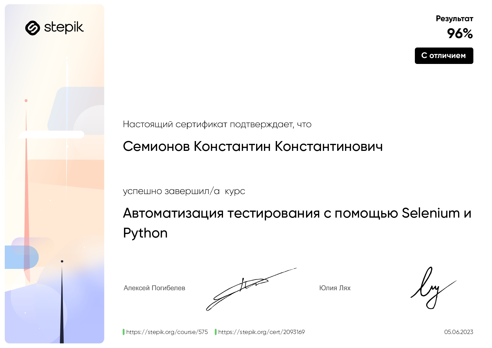
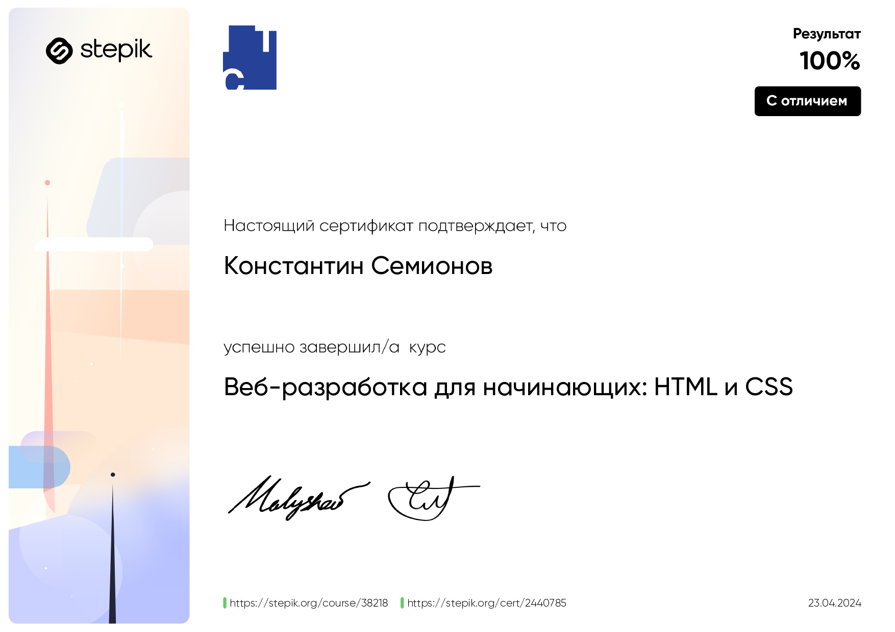
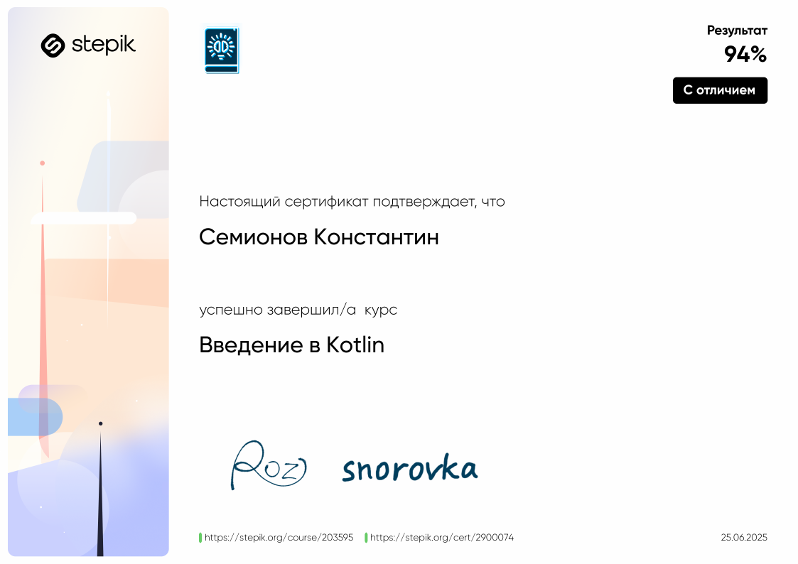

# Привет, я Константин! 👋
- [🚀 Что я умею](#what-i-can-do)
- [📚 Мои проекты](#my-projects)
- [🎯 Мои достижения](#my-achievements)
- [🎨 Вне работы](#outside-of-work)
- [🏅 Сертификаты](#certificates)

---

Я — ***QA Automation Engineer*** с опытом работы более 3 лет.
Пишу автотесты на Kotlin и Java, работаю на всех уровнях: UI, API, интеграции, БД.
Выступаю драйвером задач: беру работу с минимальной постановкой, формализую требования, оформляю документацию и довожу до результата.
Глубоко понимаю, как работает backend, умею локализовать дефекты через логи (OpenSearch, Kibana), API и SQL-запросы.

---

  <b> 🌐 Связаться со мной:</b>  

    
    

  <b>Языки программирования:</b>  

  

  <b>Инструменты разработки:</b>  

  

  <b>Работа с системами контроля версий:</b>  

  

  <b>Тестирование и автоматизация:</b>  

  

  <b>Инфраструктура и DevOps:</b>  

  

  <b>Базы данных и аналитика:</b>  

  

  <b>Операционные системы:</b>  

  

  <b>Дизайн и работа с UI:</b>  

  

## 🚀 Что я умею:

- Пишу автотесты на UI, API и БД уровнях с использованием Kotlin, Java, Python, Selenide, REST-assured, JUnit, Cucumber.
- Тестирую REST и SOAP API, использую Postman, Swagger, WireMock для ручных и интеграционных проверок.
- Анализирую логи через OpenSearch, Grafana, выявляю дефекты, подтверждаю гипотезы.
- Использую SQL (PostgreSQL, Oracle) для диагностики багов, подготовки данных и проверки логики.
- Веду задачи с нуля: разбираюсь в бизнес-логике, фиксирую сценарии, оформляю документацию в Confluence.
- Работаю с CI/CD (Jenkins, GitLab), подключаюсь к пайплайнам, отслеживаю стабильность и падения.
- Использую Git в командной работе, участвую в ревью.
- Проводил ручное тестирование мобильных приложений (Android, iOS) на реальных устройствах и эмуляторах.
## 📚 Мои проекты:

1. **Java + Rest Assured + Maven**  
   [Java Rest Assured Project](https://github.com/jackripper2703/Java-Rest-Assured)

2. **Python + Selenium**  
   [Selenium Test Project on Python](https://github.com/jackripper2703/Selenium_test_project)

3. **Java + Selenium Grid + Allure**  

   [Selenium with Grid and Allure](https://github.com/jackripper2703/SimbirSoft)

4. **Kotlin**  
   [Kotlin Telegram Bot](https://github.com/Sad-Jack/PartyPlanner)

## 🎯 Мои достижения:

- Писал автоматизированные тесты для **UI** и **API** с использованием **Cucumber**, начиная проект с нуля.
- Проводил **внутренние приемки** в сложной **финтех** компании, тестируя важные бизнес-логики и интеграции.
- Самостоятельно прорабатывал задачи без описания: уточнял логику, документировал и доводил до завершения.
- Провёл рефакторинг автотестов: убрал дубли, улучшил читаемость и поддержку.

## 🎨 Вне работы:
- Я увлекаюсь чтением книг по личностному росту и технологиям.
- Люблю решать алгоритмические задачи на **Codewars** и делиться опытом с коллегами.
- Активно участвую в айти митапах, где всегда можно узнать что-то новое и поделиться идеями.
- В свободное время наслаждаюсь настольными играми и китайским чаем.

---

Я всегда открыт для новых проектов, интересных задач и команды, с которой можно расти вместе! Если ты ищешь кого-то, кто
готов погружаться в сложные процессы тестирования и предлагать решения — я здесь.

---

## 🏅 Сертификаты:

   

   

   

   

   

   

   

   

    

