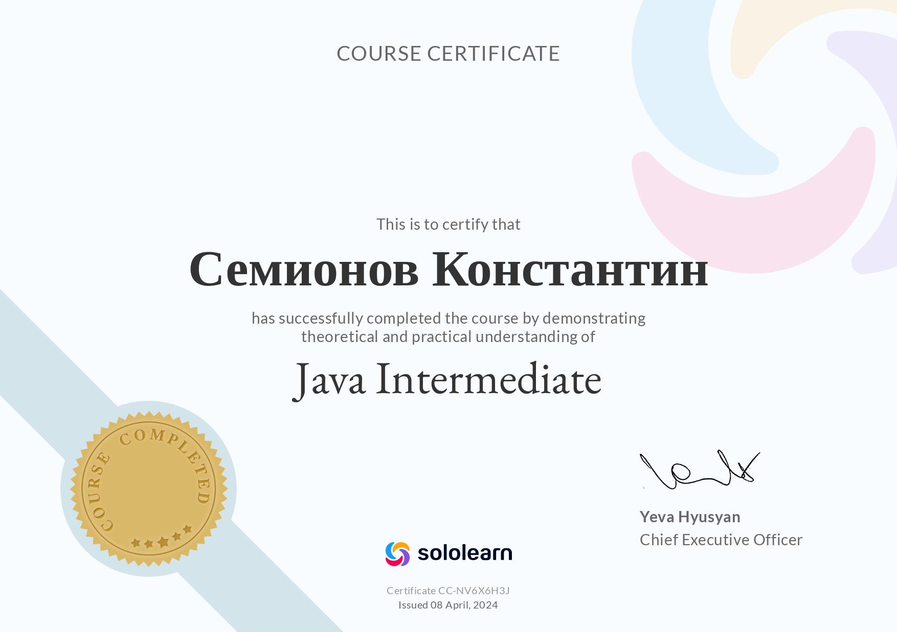
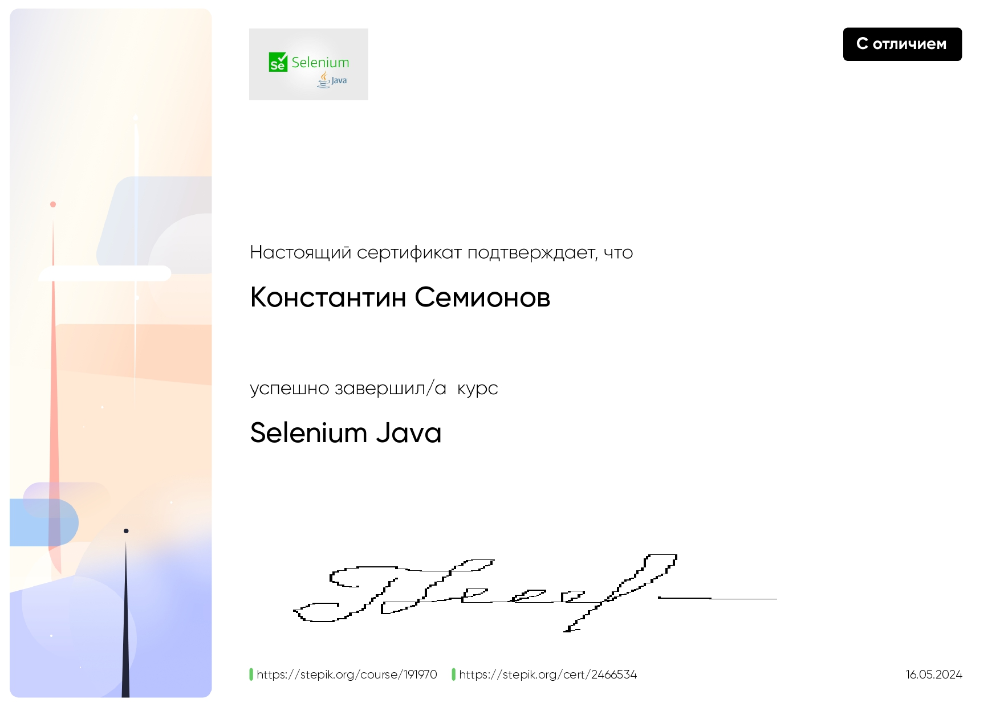
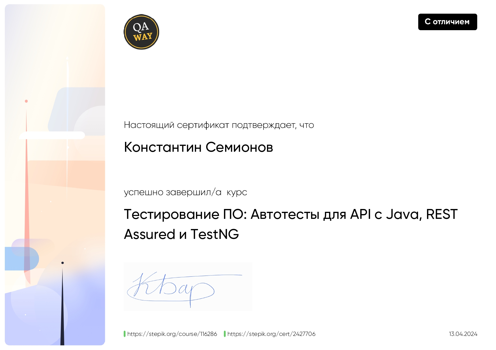
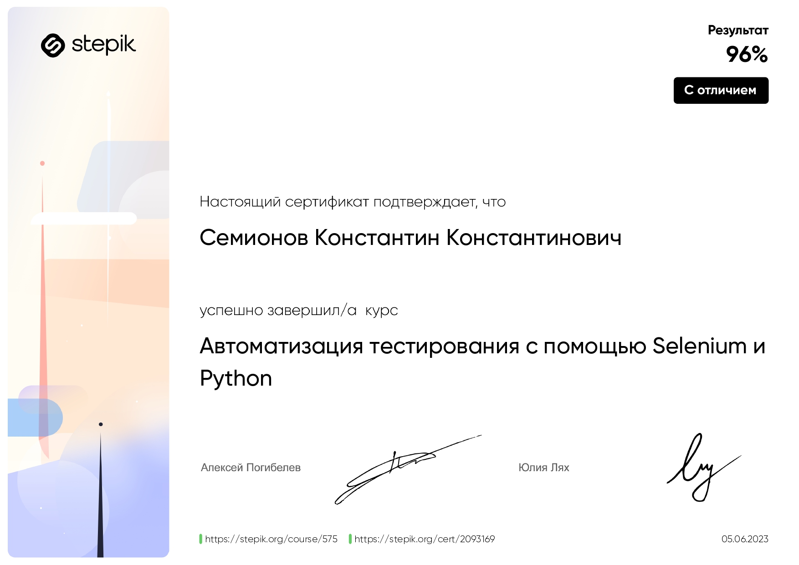
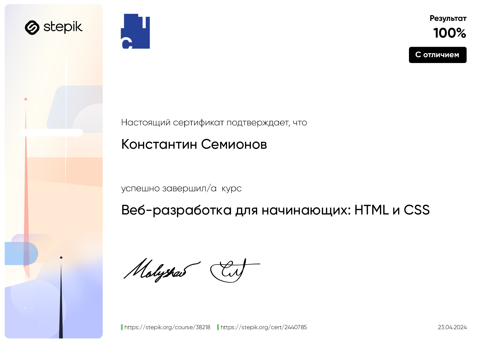
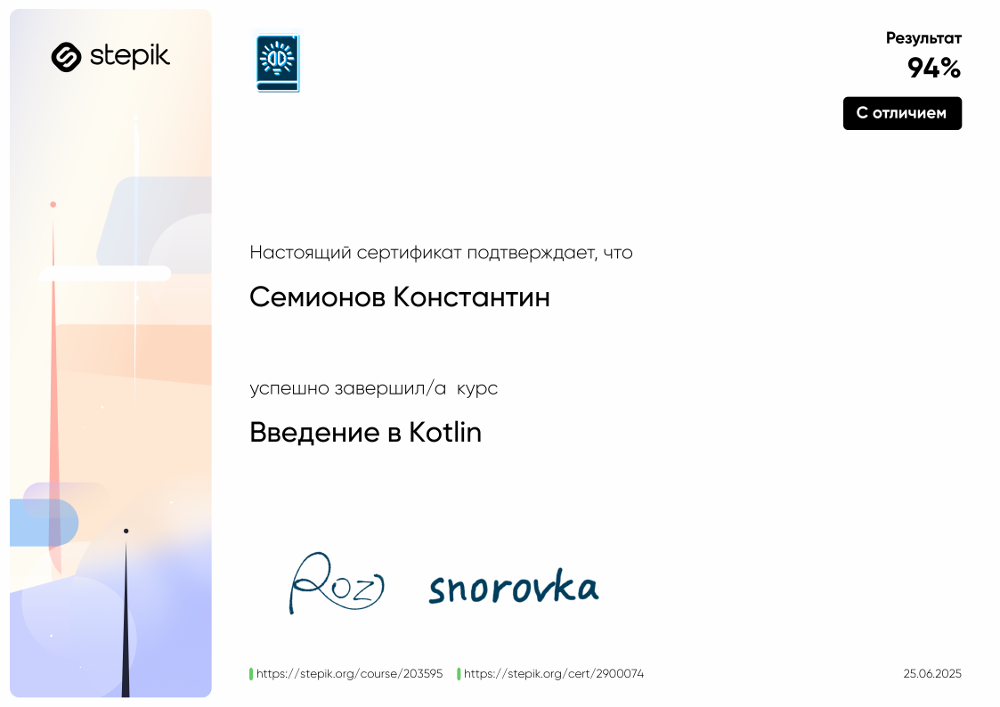

# Привет, я Константин

- [Обо мне](#about)
- [Чем я занимаюсь](#what-i-do)
- [Текущий стек](#stack)
- [Проекты](#projects)
- [Опыт и результаты](#experience)
- [Сейчас изучаю](#learning-ml)
- [Сертификаты](#certificates)
- [Контакты](#contacts)

---

## Обо мне

Я `QA Automation Engineer` с опытом более `4 лет` в тестировании веб-, мобильных и backend-систем.

Основной фокус:
- автоматизация `API`, `UI`, `DB` и интеграционных сценариев
- тестирование микросервисной архитектуры
- анализ логов, трассировок и бизнес-событий
- формализация требований и превращение неясной задачи в проверяемый сценарий

Сейчас работаю в `SENSE group`, где автоматизирую backend- и UI-проверки на `Kotlin`, тестирую интеграции между сервисами, проверяю события в `Kafka`, валидирую данные в `PostgreSQL` и `MongoDB`, а также разбираю инциденты через `Jaeger` и `OpenSearch`.

Параллельно системно двигаюсь в сторону `Machine Learning`: усиливаю Python-базу, изучаю data pipelines, классический ML и практики работы с данными.

---

## Чем я занимаюсь

- Пишу и поддерживаю автотесты на `Kotlin`, `Java` и `Python`
- Проверяю `REST API`, `SOAP`, интеграции, очереди сообщений и бизнес-логику сервисов
- Покрываю тестами `UI`, `API`, `БД`, мокированные и end-to-end сценарии
- Диагностирую дефекты через `OpenSearch`, `Kibana`, `Grafana`, `Jaeger`, `SQL`
- Работаю с `PostgreSQL`, `MongoDB`, `Oracle`, готовлю тестовые данные и валидирую состояние системы
- Подключаю тесты к `CI/CD`, разбираю падения пайплайнов и повышаю стабильность прогонов
- Участвую в ревью, проработке требований, тест-дизайне и технической документации

---

## Текущий стек

**Языки и основы**

  

**Инструменты разработки**

  

**Тестирование и инфраструктура**

  

**Базы данных и наблюдаемость**

  

**Дополнительно**

- `JUnit5`, `Selenide`, `REST Assured`, `Cucumber`, `WireMock`
- `Kafka`, `Swagger`, `DevTools`, `DBeaver`, `Xcode`, `Android Studio`
- `Jaeger`, `TestOps`, `Jenkins`, `GitLab CI/CD`

---

## Проекты

1. **Machine Learning | Customer Churn Prediction**  
   [Customer Churn Prediction](https://github.com/Sad-Jack/customer-churn-prediction)

2. **Java + Rest Assured + Maven**  
   [Java Rest Assured Project](https://github.com/jackripper2703/Java-Rest-Assured)

3. **Python + Selenium**  
   [Selenium Test Project on Python](https://github.com/jackripper2703/Selenium_test_project)

4. **Java + Selenium Grid + Allure**  
   [Selenium with Grid and Allure](https://github.com/jackripper2703/SimbirSoft)

5. **Kotlin**  
   [Kotlin Telegram Bot](https://github.com/Sad-Jack/PartyPlanner)

Профиль будет дальше дополняться ML-проектами и Python-репозиториями, чтобы последовательно отражать мой переход в сторону работы с данными и `Machine Learning`.

---

## Опыт и результаты

### SENSE group
`Сентябрь 2025 — настоящее время`

- Автоматизация backend- и UI-проверок на `Kotlin`, `JUnit5`, `Gradle`, `REST Assured`, `Selenide`
- Тестирование микросервисных интеграций, событий в `Kafka`, данных в `PostgreSQL` и `MongoDB`
- Анализ межсервисных вызовов через `Jaeger`, логов и событий через `OpenSearch`
- Использование `WireMock` и `Proxyman` для изоляции зависимостей и анализа трафика

### AVOSEND
`Июль 2024 — Сентябрь 2025`

- Разрабатывал и поддерживал тестовую базу для `Web`, `Mobile`, `API` и `DB`
- Работал со стеком `Kotlin`, `Spring Boot`, `JUnit5`, `Selenide`, `REST Assured`, `JDBC`, `Cucumber`
- Участвовал в улучшении архитектуры автотестов и сокращении технического долга
- Брал в работу задачи без формализованного описания и доводил их до документации и проверяемого результата

### SberTech
`Август 2023 — Июль 2024`

- Автоматизировал сквозные сценарии `UI + API` на `Java`, `Maven`, `JUnit`, `Selenium`, `REST Assured`
- Интегрировал проверки в `Jenkins`, работал с `Docker` и `Selenoid`
- Поддерживал стандарты тестовой документации и участвовал в `PR review`

### AppEvent
`Март 2022 — Август 2023`

- Строил с нуля автотесты на `Python`, `Selenium`, `PyTest`, `Allure`
- Тестировал мобильные и веб-продукты, API и бизнес-логику через `Postman`, `Swagger`, `DBeaver`
- Помогал систематизировать тестовую логику, окружения и регрессионные прогоны

**Что умею приносить команде**

- Усиливаю качество не только тестами, но и ясностью в требованиях
- Нахожу дефекты на стыке сервисов, данных и бизнес-логики
- Улучшаю читаемость и поддержку тестовой базы через рефакторинг
- Работаю в задачах, где нужно сначала разобраться, а уже потом автоматизировать

---

## Сейчас изучаю

`Machine Learning` для меня сейчас не декоративный пункт в профиле, а отдельный вектор развития.

Фокус на ближайший период:
- `Python` для задач работы с данными
- `NumPy`, `Pandas`, базовый `EDA`
- классические ML-подходы и построение простых пайплайнов
- оформление pet-проектов так, чтобы они показывали не только код, но и ход мысли: данные, гипотезы, метрики, выводы

Мне интересна зона пересечения `QA`, `данных` и `ML`: автоматизация проверок, валидация качества, тестирование data-driven систем и дальнейший переход в более сильную инженерную работу вокруг ML-продуктов.

Что уже делаю в этом направлении:
- ML-проект: [Customer Churn Prediction](https://github.com/Sad-Jack/customer-churn-prediction)
- Курс на Stepik: [Machine Learning](https://stepik.org/course/281722/promo)
- Telegram-канал: [ML Road](https://t.me/ML_Road)

---

## Контакты

- Telegram: [@JACK_R_I_P](https://t.me/JACK_R_I_P)
- Telegram-канал: [ML Road](https://t.me/ML_Road)
- LinkedIn: [konstantin-semionov-367171340](https://www.linkedin.com/in/konstantin-semionov-367171340/)
- Email: [sad.sadsad.sad@yandex.ru](mailto:sad.sadsad.sad@yandex.ru)

---

## Сертификаты

   

   

   

   

   

   

   

   

---

  

Сейчас мой основной вектор развития связан с `Machine Learning`: учусь, собираю практические проекты и последовательно строю карьеру в этом направлении.
